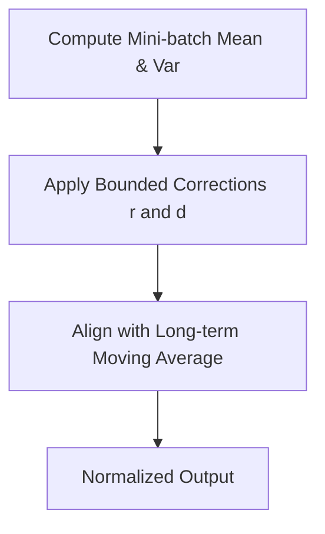

# Batch Renormalization (BatchRenorm)

Batch Renormalization introduces correction metrics to account for variations between mini-batch statistics and running long-term moving averages.

## Mechanism
Introduces bounded variables $r$ and $d$ to reparameterize the normalization step to match the moving average statistics.

## Mermaid Diagram

## Significance & Limitations
- **Significance:** Minimizes the performance drop when training on small or non-i.i.d. mini-batches.
- **Limitation:** Introduces extra hyperparameters that require careful tuning.

[Back to README](../README.md)
