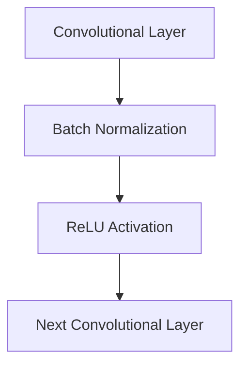

# CNNs for Image Classification

In Convolutional Neural Networks, Batch Normalization is systematically embedded after convolutional layers.

## Mechanism
Normalizes the spatial activations across the batch to stabilize training in deep structures like ResNet and Inception.

## Mermaid Diagram

## Significance & Limitations
- **Significance:** Essential for training deep CNN architectures without encountering exploding or vanishing gradients.
- **Limitation:** High memory consumption during training.

[Back to README](../README.md)
