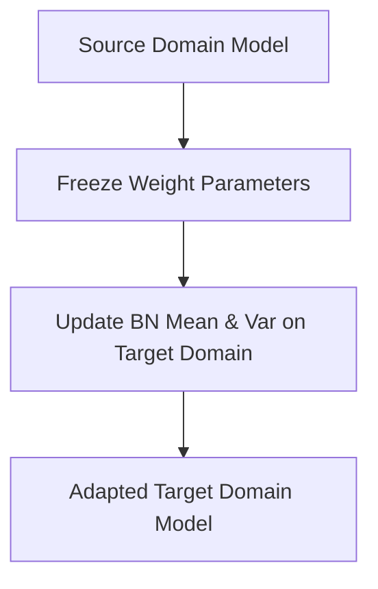

# Domain Adaptation Pipelines

Batch Normalization statistics can be frozen or adapted to handle shifts in data distribution between training (source) and test (target) domains.

## Mechanism
Adapt target statistics by calculating running mean and variance on target domain samples while keeping trained weights frozen.

## Mermaid Diagram

## Significance & Limitations
- **Significance:** Zero-parameter domain adaptation method (AdaBN) that quickly aligns feature distributions.
- **Limitation:** Only corrects for marginal distribution shifts, not complex conditional distribution shifts.

[Back to README](../README.md)
