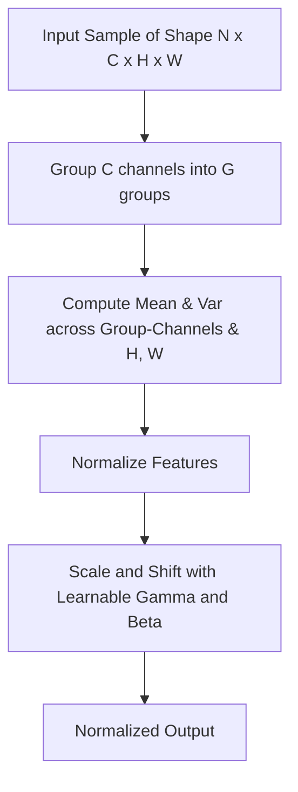

# Group Normalization (GroupNorm)

Group Normalization divides channels into small, distinct groups and normalizes the features within each group.

## Mechanism
Channels are grouped into $G$ groups, and mean and variance are computed across the grouped channels and spatial dimensions.

## Mermaid Diagram

## Significance & Limitations
- **Significance:** Acts as a flexible middle ground between LayerNorm and InstanceNorm, offering stable performance independent of batch size.
- **Limitation:** Performance depends heavily on the choice of group size hyperparameter $G$.

[Back to README](../README.md)
