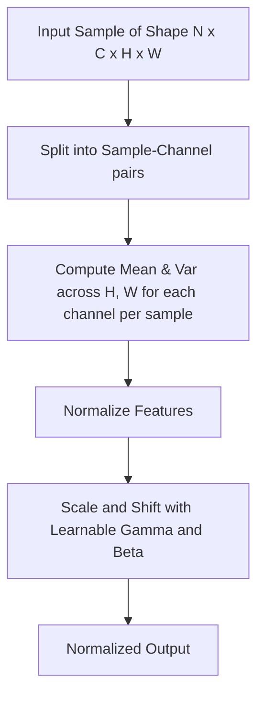

# Instance Normalization (InstanceNorm)

Instance Normalization normalizes features purely across the spatial dimensions ($H \times W$) for each individual channel and sample.

## Mechanism
The normalization statistics are computed independently for each channel in each sample.

## Mermaid Diagram

## Significance & Limitations
- **Significance:** Acts as a style-normalization step, making it highly effective for style transfer and GANs.
- **Limitation:** Not suitable for tasks requiring absolute feature scale representation.

[Back to README](../README.md)
