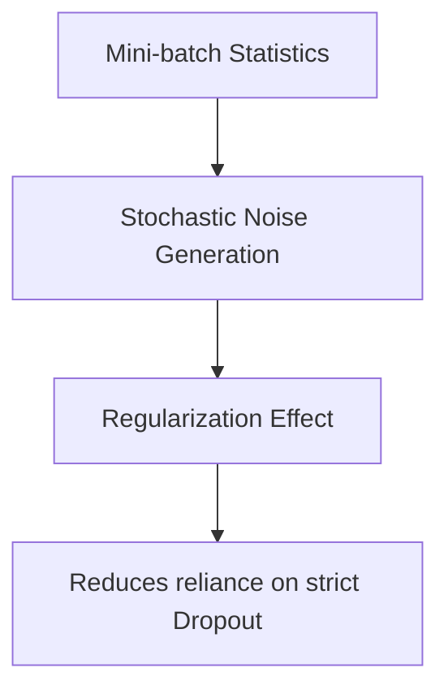

# Internal Network Regularization

Batch Normalization acts as a minor regularizer due to the stochastic noise introduced by mini-batch statistics.

## Mechanism
Since mean and variance are computed on mini-batches, they act as noise generators, similar to Dropout.

## Mermaid Diagram

## Significance & Limitations
- **Significance:** Often allows training deep networks without explicit dropout.
- **Limitation:** The regularization strength is linked to the batch size and cannot be independently tuned easily.

[Back to README](../README.md)
