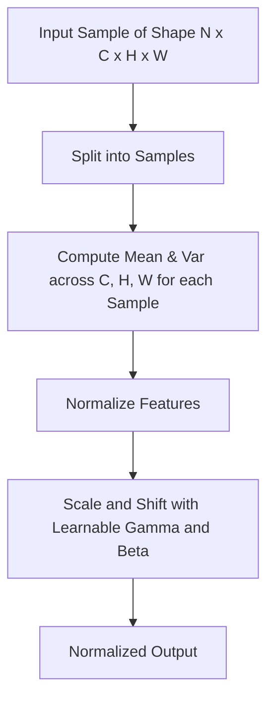

# Layer Normalization (LayerNorm)

Layer Normalization normalizes all features across the channel and hidden dimensions for each training sample independently.

## Mechanism
Unlike BatchNorm, LayerNorm computes statistics across the feature/channel dimension ($C$) for each sample individually.

## Mermaid Diagram

## Significance & Limitations
- **Significance:** Excellent for sequence models (Transformers, RNNs/LSTMs) as it is independent of batch size.
- **Limitation:** Can be less effective than BatchNorm in CNNs due to spatial correlation ignoring.

[Back to README](../README.md)
