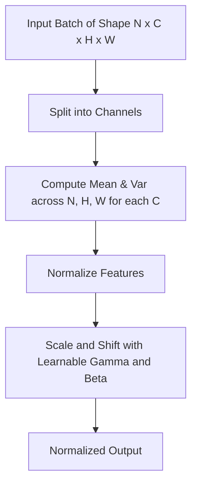

# Standard Batch Normalization (BatchNorm)

Standard Batch Normalization is a foundational technique that normalizes features across the mini-batch dimension.

## Mechanism
For a mini-batch $B$ of size $N$ and a feature channel of spatial dimensions $H \times W$, standard BatchNorm calculates the mean and variance across the batch dimension ($N$) and spatial dimensions ($H \times W$).

$$x_i \leftarrow \frac{x_i - \mu_B}{\sqrt{\sigma_B^2 + \epsilon}}$$

## Mermaid Diagram

## Significance & Limitations
- **Significance:** Accelerates training convergence, reduces sensitivity to initialization, and acts as a regularizer.
- **Limitation:** Performance degrades severely when the mini-batch size is very small.

[Back to README](../README.md)
