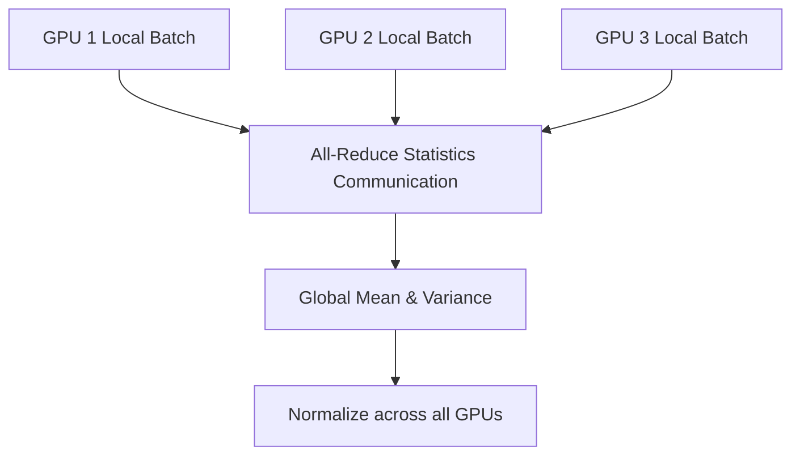

# Synchronized Batch Normalization (SyncBN)

Synchronized Batch Normalization computes the global mean and variance across all active worker GPUs in distributed training.

## Mechanism
Instead of computing BN statistics locally on each card, SyncBN performs cross-GPU communication (all-reduce) to obtain global batch statistics.

## Mermaid Diagram

## Significance & Limitations
- **Significance:** Crucial for tasks like object detection and segmentation where batch size per GPU is extremely small.
- **Limitation:** Introduces communication overhead across GPUs, which can slow down training speed slightly.

[Back to README](../README.md)
