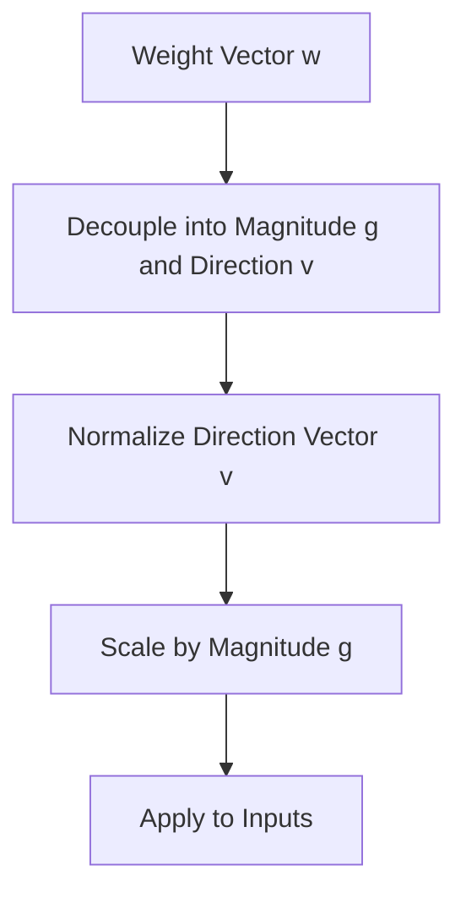

# Weight Normalization (WeightNorm)

Weight Normalization reparameterizes weight vectors of a neural network by decoupling their length from their direction.

## Mechanism
Instead of normalizing activations, it normalizes the weight parameters directly:
$$w = \frac{g}{\|v\|} v$$

## Mermaid Diagram

## Significance & Limitations
- **Significance:** Data-independent, making it highly suitable for LSTMs, reinforcement learning, and generative models.
- **Limitation:** Does not guarantee bound activation ranges like activation normalization techniques.

[Back to README](../README.md)
